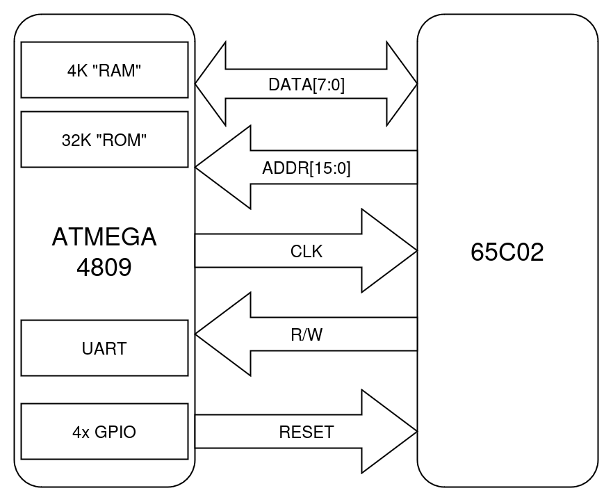

# VR65C02
A 6502 computer system with an ATmega4809 simulating all of the memory and I/O. Two ICs are enough to run native 6502 code on the real silicon. All of the 6502's interactions with the outside world go through the microcontroller.

It's like the 6502 is wearing the ATmega as a VR headset! (AVR headset?)

## Background

### TL;DR

- Real 6502 code running on a real 6502
- ATmega4809 microcontroller emulates everything else
- 6502 is programmed by uploading an Arduino sketch
- 5KB of emulated RAM, up to 32KB emulated ROM
- Memory-mapped UART, GPIO, and I2C peripherals for the 6502
- Eye-watering clock speed of ~250 kHz!

### Why?

Why not? This project started as a weekend experiment to see if I could run a 6502 CPU without having to use a real ROM chip. That quickly turned into "Can I run 6502 code on a real CPU without any real memory or peripherals attached. The answer is yes.

This computer is not fast. It's not practical, but it is kind of fun.

### Why not a Raspberry Pi Pico or FPGA?

Those would both likely be better choices, but to be totally honest, the availability of the ATmega4809 in a 40 pin DIP package is what sold me. I like the aesthetic of two DIP ICs. That's really it.

## Features

### Memory Emulation

VR65C02 is a fully functional computer system. The ATmega microcontroller provides emulated RAM and ROM as well as a passthrough UART and four GPIO pins that the 6502 can access.

The microcontroller controls the RESET and CLOCK lines of the CPU, so all memory access is handled synchronously by the Arduino code. For each bus cycle, the microcontroller reads the address bus and R/W pin from the CPU. If the CPU is reading a memory address, the microcontroller will decode the address into a memory value or an I/O operation and write the appropriate value out to the data bus. On a write cycle, the microcontroller reads the data bus value into its simulated RAM or updates the appropriate I/O system. The microcontroller implements address decoding in code in a similar way to a traditional system using logic gates or PLDs.

Both RAM and ROM are backed by large byte arrays in the microcontroller's memory, the RAM using onboard SRAM and the ROM using onboard Flash.

### I/O Emulation

The UART is a memory-mapped I/O device from the perspective of the 6502, similar to a 6551 ACIA. The CPU can read and write bytes and the microcontroller passes them through to one of its native serial ports.

Similarly, there are four GPIO pins accessible as a memory-mapped register to the 6502.

These GPIO ports have two alternate functions. If SOFT_RESET is defined in [memory_map.h](src/6502_vr_goggles/memory_map.h), then GPIO pin 0 will function as a reset pin for the 6502. It does not reset the Arduino, but it triggers the Arduino to reset the 6502. If soft reset is enabled, pin 0 cannot be used as a normal GPIO pin.

I2C devices can also be attached to the GPIO pins. GPIO 2 and 3 double as SDA and SCL respectively. The Arduino provides low level access to the I2C bus through a few memory-mapped registers. The 6502 can enable/disable the I2C bus, set the active peripheral address, and read/write data through these registers.

See [memory_map.h](src/6502_vr_goggles/memory_map.h) for more details.

It should also be possible to implement SPI passthrough in a similar fashion, but I2C is really a better fit for this system, especially considering its slow clock speed and lack of I/O lines. With I2C, a ton of peripherals can be daisy-chained and there is still room for 1 or 2 GPIO pins. I've tested reading a real-time clock module over I2C from the 6502 code (see the `time` command in [monitor.c](src/monitor.c)).

### Memory Map

The memory map of the 6502 is as follows:
1. 5KB "RAM" at 0x0000
2. I/O regisers at 0x7F00
3. 8KB "ROM" at 0xE000

The ATmega4809 has enough flash memory to support up to 32KB of ROM if necessary, but the total onboard SRAM is only 6KB and some is set aside for the Arduino code.

## Software

The core of VR65C02 is the Arduino sketch running on the ATmega4809. As described above, this program simulates the entire bus cycle of the physical 6502 CPU and all of the memory and I/O interactions.

Real 6502 machine code is running on the CPU. This can be assembly or C code compiled with cc65. Since there is no physical ROM or RAM, the code has to live somewhere. My approach is to use the large amount of onboard Flash memory of the ATmega to store this. The main trick of VR65C02 is taking this compiled binary and getting it into the microcontroller Flash as part of the Arduino sketch upload.

### Setup

To build and deploy code to the VR65C02, you'll need to setup the following:
1. Install Arduino to `/opt/local`
2. Install MegaCoreX Arduino package
3. Install cc65 or some other 6502 compiler/assembler
4. Install make (`build-essential` on Debian/Ubuntu)
5. Install Python 3.x

Note: you may need to update the build.sh script if you're on a different platform. Windows will probably require a different approach.

### Building

The build process is done in a single script, [build.sh](src/build.sh). The process looks like this:
1. Compile 6502 C code into a binary ROM file.
2. Run a Python script to convert this binary file into a C header file with a large const array of bytes.
3. Compile the Arduino sketch with this generated header file.
4. Upload Arduino sketch to microcontroller with new 6502 code.

### Programming the ATmega (and by extension the 6502)

Programming the ATmega4809 is done via UPDI. UPDI is a one-wire programming interface that can be implemented over a simple serial port. On VR65C02, the wiring is already done on the board, so a standard FTDI-style USB-UART can be plugged into the onboard UPDI header. In the Arduino IDE, the SerialUPDI programmer included in MegaCoreX at 230400 baud will work just fine. Make sure to set the serial port to the UPDI USB device and not the one plugged into the UART port.

Note: the board and programmer selection is already done in the [build.sh](src/build.sh) script using the `arduino-cli` command.

It's possible to use a single FTDI device and switch between the headers on board for programming versus serial monitoring, but having two different serial ports is a lot more convenient.

## Limitations

All of the limitations of this system come down to hitting the limits of the ATmega4809 itself in one way or another.

### Clock Speed

The main drawback is obviously clock speed. Simulating the whole bus cycle and all of the potential memory and I/O operations of the 6502 on a 20 MHz 8-bit microcontroller is not exactly quick. Measuring the PHI2 output on the CPU with an oscilloscope shows that the effective clock speed is about 257 kHz. Even at this speed, VR65C02 is surprisingly usable for simple GPIO tasks or interacting over the serial port, but it's about 4x slower than a Commodore 64 or Apple II.

Because not all the emulated peripherals respond at the same speed, the effective clock speed is actually somewhat variable depending on the I/O demands of the 6502 code. This doesn't fluctuate too dramatically, but heavy I/O, e.g. polling the serial port, will run at around 257 kHz, whereas no I/O at all will get the clock up to about 270 kHz.

### Not Enough Pins

Besides the slow speed, the other main limitations is the lack of available pins on the ATmega. All 31 available IO pins are being used to connect to the 6502 bus and control signals. Two of the pins are used for the serial port and four are set up as GPIO. The GPIO pins could be used for other things, but there's not a huge number to spare.

In theory, these GPIO pins could be repurposed as chip-select signals to attach some real I/O devices to the system. It wouldn't be a stretch to attach a real RAM chip and have the microcontroller copy the program code from Flash into that RAM. In that scenario, a real clock oscillator could be used and the Arduino would become a slow peripheral using the RDY pin to handle the higher clock rate.

The ATmega4809 is also available in a 48 pin QFP package with quite a few more I/O pins. This might be fun to explore, but it would definitely detract from the DIP aesthetic and make VR65C02 harder to build.
